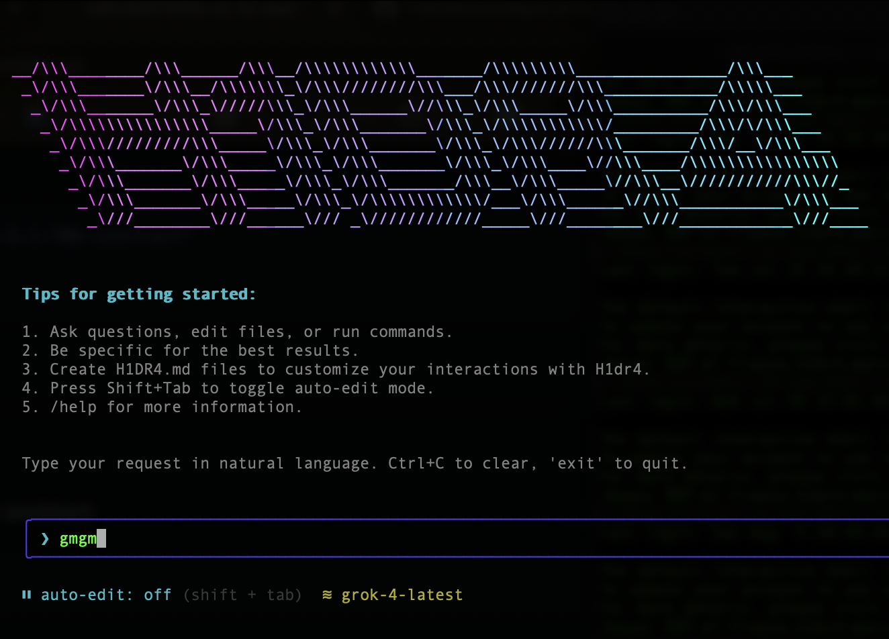
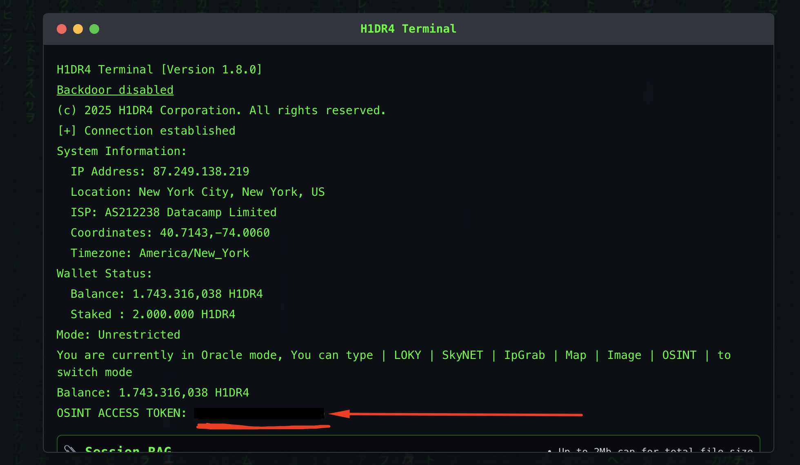

# H1DR4 CLI

A conversational AI CLI tool powered by H1DR4 with intelligent text editor capabilities and tool usage.



## Features

- **🤖 Conversational AI**: Natural language interface powered by H1DR4
- **📝 Smart File Operations**: AI automatically uses tools to view, create, and edit files
- **⚡ Bash Integration**: Execute shell commands through natural conversation
- **🔧 Automatic Tool Selection**: AI intelligently chooses the right tools for your requests
- **🧠 Reasoning Engine**: Access a dedicated reasoning endpoint for complex questions
- **🔍 OSINT Search**: Query public data sources using the `osint_search` tool (set `OSINT_TOKEN`)
- **🚀 Morph Fast Apply**: Optional high-speed code editing at 4,500+ tokens/sec with 98% accuracy
- **🔌 MCP Tools**: Extend capabilities with Model Context Protocol servers (Linear, GitHub, etc.)
- **💬 Interactive UI**: Beautiful terminal interface built with Ink
- While the agent is executing tasks, you can continue typing new requests.
These messages are queued and the active plan is updated on the fly—no need
to cancel the current run.
- **🌍 Global Installation**: Install and use anywhere with `npm i -g @h1dr4/h1dr4-cli`

## Installation

### Prerequisites
- Node.js 16+
- Grok API key from X.AI
- (Optional, Recommended) Morph API key for Fast Apply editing

### Global Installation (Recommended)
```bash
npm install -g @h1dr4/h1dr4-cli
```

or

### Local Development
```bash
git clone https://github.com/nativ3ai/H1DR4-cli.git
cd h1dr4-cli
npm install
npm run build
npm link
```

## Setup

## Setup

### 1. Get your credentials

You will need **a Grok API Key** (required) and optionally an **OSINT Access Token** (recommended for best experience).  

There are **two ways** to get a Grok API Key:

1. **Use your own** → [X.AI](https://x.ai) lets you create your own Grok API token and set your own usage limits.  
2. **Use [H1DR4](h1dr4.dev)** → If you **hold ≥500k $H1DR4** or **stake ≥100k $H1DR4**, you can claim both:  
   - A **rate-limited Grok API Key**  
   - An **OSINT Access Token**  

👉 To claim via H1DR4.dev/terminal, run (through the website):

```bash
balance
```
This will display your tokens directly.

**2. Set up your grok API key (choose one method):**

Set it as Environment Variable with:

```bash
export GROK_API_KEY=your_api_key_here
```
or 

```bash
h1dr4 --api-key your_api_key_here
```

### (Optional, Recommended)

*Note*: The CLI will work with just the Grok API Key, but adding the OSINT Access Token unlocks additional features and improves the overall experience.

If you also want to enable OSINT features you’ll need to set your OSINT_TOKEN too before running the interface:

-> get one either at:
[Telegram](https://t.me/osintbotbot) -> siply click: menu -> api 

or throught 

[H1DR4](https://h1dr4.dev/terminal) -> type "balance" [*DISCLAMER* You must hold 500k+ $H1DR4 or have 100k $H1DR4 staked, YOU WILL ALSO FIND A RATE LIMITED GROK API]:



**Environment Variable**
```bash
export OSINT_TOKEN=your-h1dr4_osint-token
```

### Get your Morph API key from [Morph Dashboard](https://morphllm.com/dashboard/api-keys)

**Set up your Morph API key for Fast Apply editing (choose one method):**

**Environment Variable**
```bash
export MORPH_API_KEY=your_morph_api_key_here
```
### Custom Base URL (Optional)

By default, the CLI uses `https://api.x.ai/v1` as the Grok API endpoint. You can configure a custom endpoint if needed (choose one method):

Method 1: Environment Variable
```bash
export GROK_BASE_URL=https://your-custom-endpoint.com/v1
```

Method 2: Command Line Flag
```bash
h1dr4 --api-key your_api_key_here --base-url https://your-custom-endpoint.com/v1
```

Method 3: User Settings File
Add to `~/.h1dr4/user-settings.json`:
```json
{
  "apiKey": "your_api_key_here",
  "baseURL": "https://your-custom-endpoint.com/v1"
}
```

## Usage

### Interactive Mode

Start H1DR4:
```bash
h1dr4
```

Or specify a working directory:
```bash
h1dr4 -d /path/to/project
```

### Headless Mode

Process a single prompt and exit (useful for scripting and automation):
```bash
h1dr4 --prompt "show me the package.json file"
h1dr4 -p "create a new file called example.js with a hello world function"
h1dr4 --prompt "run npm test and show me the results" --directory /path/to/project
h1dr4 --prompt "complex task" --max-tool-rounds 50  # Limit tool usage for faster execution
```

This mode is particularly useful for:
- **CI/CD pipelines**: Automate code analysis and file operations
- **Scripting**: Integrate AI assistance into shell scripts
- **Terminal benchmarks**: Perfect for tools like Terminal Bench that need non-interactive execution
- **Batch processing**: Process multiple prompts programmatically

### Tool Execution Control

By default, H1DR4 CLI allows up to 400 tool execution rounds to handle complex multi-step tasks. You can control this behavior:

```bash
# Limit tool rounds for faster execution on simple tasks
h1dr4 --max-tool-rounds 10 --prompt "show me the current directory"

# Increase limit for very complex tasks (use with caution)
h1dr4 --max-tool-rounds 1000 --prompt "comprehensive code refactoring"

# Works with all modes
h1dr4 --max-tool-rounds 20  # Interactive mode
h1dr4 git commit-and-push --max-tool-rounds 30  # Git commands
```

**Use Cases**:
- **Fast responses**: Lower limits (10-50) for simple queries
- **Complex automation**: Higher limits (500+) for comprehensive tasks
- **Resource control**: Prevent runaway executions in automated environments

### Model Selection

You can specify which AI model to use with the `--model` parameter or `H1DR4_MODEL` environment variable:

**Method 1: Command Line Flag**
```bash
# Use H1DR4 models
h1dr4 --model grok-4-latest
h1dr4 --model grok-3-latest
h1dr4 --model grok-3-fast

# Use other models (with appropriate API endpoint)
h1dr4 --model gemini-2.5-pro --base-url https://api-endpoint.com/v1
h1dr4 --model claude-sonnet-4-20250514 --base-url https://api-endpoint.com/v1
```

**Method 2: Environment Variable**
```bash
export H1DR4_MODEL=grok-4-latest
export OSINT_TOKEN=your_osint_token_here
h1dr4
```

**Method 3: User Settings File**
Add to `~/.h1dr4/user-settings.json`:
```json
{
  "apiKey": "your_api_key_here",
  "defaultModel": "grok-4-latest"
}
```

**Model Priority**: `--model` flag > `H1DR4_MODEL` environment variable > user default model > system default (grok-4-latest)

### Command Line Options

```bash
h1dr4 [options]

Options:
  -V, --version          output the version number
  -d, --directory <dir>  set working directory
  -k, --api-key <key>    Grok API key (or set GROK_API_KEY env var)
  -u, --base-url <url>   Grok API base URL (or set GROK_BASE_URL env var)
  -m, --model <model>    AI model to use (e.g., grok-4-latest, grok-3-latest) (or set H1DR4_MODEL env var)
  -p, --prompt <prompt>  process a single prompt and exit (headless mode)
  --max-tool-rounds <rounds>  maximum number of tool execution rounds (default: 400)
  -h, --help             display help for command
```


## Configuration Files

H1DR4 CLI uses two types of configuration files to manage settings:

### User-Level Settings (`~/.h1dr4/user-settings.json`)

This file stores **global settings** that apply across all projects. These settings rarely change and include:

- **API Key**: Your Grok API key
- **Base URL**: Custom API endpoint (if needed)
- **Default Model**: Your preferred model (e.g., `grok-4-latest`)
- **Available Models**: List of models you can use

**Example:**
```json
{
  "apiKey": "your_api_key_here",
  "baseURL": "https://api.x.ai/v1",
  "defaultModel": "grok-4-latest",
  "models": [
    "grok-4-latest",
    "grok-3-latest",
    "grok-3-fast",
    "grok-3-mini-fast"
  ]
}
```

### Project-Level Settings (`.h1dr4/settings.json`)

This file stores **project-specific settings** in your current working directory. It includes:

- **Current Model**: The model currently in use for this project
- **MCP Servers**: Model Context Protocol server configurations

**Example:**
```json
{
  "model": "grok-3-fast",
  "mcpServers": {
    "linear": {
      "name": "linear",
      "transport": "stdio",
      "command": "npx",
      "args": ["@linear/mcp-server"]
    }
  }
}
```

### How It Works

1. **Global Defaults**: User-level settings provide your default preferences
2. **Project Override**: Project-level settings override defaults for specific projects
3. **Directory-Specific**: When you change directories, project settings are loaded automatically
4. **Fallback Logic**: Project model → User default model → System default (`grok-4-latest`)

This means you can have different models for different projects while maintaining consistent global settings like your API key.

### Using Other API Providers

**Important**: H1DR4 CLI uses **OpenAI-compatible APIs**. You can use any provider that implements the OpenAI chat completions standard.

**Popular Providers**:
- **X.AI**: `https://api.x.ai/v1` (default)
- **OpenAI**: `https://api.openai.com/v1`
- **OpenRouter**: `https://openrouter.ai/api/v1`
- **Groq**: `https://api.groq.com/openai/v1`

**Example with OpenRouter**:
```json
{
  "apiKey": "your_openrouter_key",
  "baseURL": "https://openrouter.ai/api/v1",
  "defaultModel": "anthropic/claude-3.5-sonnet",
  "models": [
    "anthropic/claude-3.5-sonnet",
    "openai/gpt-4o",
    "meta-llama/llama-3.1-70b-instruct"
  ]
}
```

### Custom Instructions

You can provide custom instructions to tailor H1DR4's behavior to your project by creating a `.h1dr4/H1DR4.md` file in your project directory:

```bash
mkdir .h1dr4
```

Create `.h1dr4/H1DR4.md` with your custom instructions:
```markdown
# Custom Instructions for H1DR4 CLI

Always use TypeScript for any new code files.
When creating React components, use functional components with hooks.
Prefer const assertions and explicit typing over inference where it improves clarity.
Always add JSDoc comments for public functions and interfaces.
Follow the existing code style and patterns in this project.
```

H1DR4 will automatically load and follow these instructions when working in your project directory. The custom instructions are added to H1DR4's system prompt and take priority over default behavior.

## Morph Fast Apply (Optional)

H1DR4 CLI supports Morph's Fast Apply model for high-speed code editing at **4,500+ tokens/sec with 98% accuracy**. This is an optional feature that provides lightning-fast file editing capabilities.

**Setup**: Configure your Morph API key following the [setup instructions](#setup) above.

### How It Works

When `MORPH_API_KEY` is configured:
- **`edit_file` tool becomes available** alongside the standard `str_replace_editor`
- **Optimized for complex edits**: Use for multi-line changes, refactoring, and large modifications
- **Intelligent editing**: Uses abbreviated edit format with `// ... existing code ...` comments
- **Fallback support**: Standard tools remain available if Morph is unavailable

**When to use each tool:**
- **`edit_file`** (Morph): Complex edits, refactoring, multi-line changes
- **`str_replace_editor`**: Simple text replacements, single-line edits

### Example Usage

With Morph Fast Apply configured, you can request complex code changes:

```bash
h1dr4 --prompt "refactor this function to use async/await and add error handling"
h1dr4 -p "convert this class to TypeScript and add proper type annotations"
```

The AI will automatically choose between `edit_file` (Morph) for complex changes or `str_replace_editor` for simple replacements.

## MCP Tools

H1DR4 CLI supports MCP (Model Context Protocol) servers, allowing you to extend the AI assistant with additional tools and capabilities.

### Adding MCP Tools

#### Add a custom MCP server:
```bash
# Add an stdio-based MCP server
h1dr4 mcp add my-server --transport stdio --command "node" --args server.js

# Add an HTTP-based MCP server
h1dr4 mcp add my-server --transport http --url "http://localhost:3000"

# Add with environment variables
h1dr4 mcp add my-server --transport stdio --command "python" --args "-m" "my_mcp_server" --env "API_KEY=your_key"
```

#### Add from JSON configuration:
```bash
h1dr4 mcp add-json my-server '{"command": "node", "args": ["server.js"], "env": {"API_KEY": "your_key"}}'
```

### Linear Integration Example

To add Linear MCP tools for project management:

```bash
# Add Linear MCP server
h1dr4 mcp add linear --transport sse --url "https://mcp.linear.app/sse"
```

This enables Linear tools like:
- Create and manage Linear issues
- Search and filter issues
- Update issue status and assignees
- Access team and project information

### Managing MCP Servers

```bash
# List all configured servers
h1dr4 mcp list

# Test server connection
h1dr4 mcp test server-name

# Remove a server
h1dr4 mcp remove server-name
```

### Available Transport Types

- **stdio**: Run MCP server as a subprocess (most common)
- **http**: Connect to HTTP-based MCP server
- **sse**: Connect via Server-Sent Events

## Development

```bash
# Install dependencies
npm install

# Development mode
npm run dev

# Build project
npm run build

# Run linter
npm run lint

# Type check
npm run typecheck
```

## Architecture

- **Agent**: Core command processing and execution logic
- **Tools**: Text editor and bash tool implementations
- **UI**: Ink-based terminal interface components
- **Types**: TypeScript definitions for the entire system

## License

MIT
